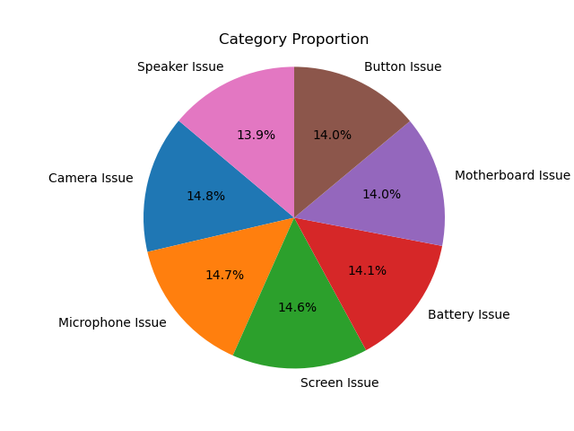
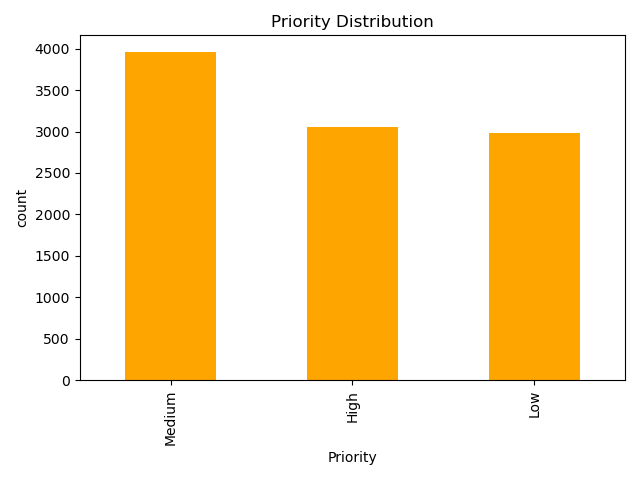
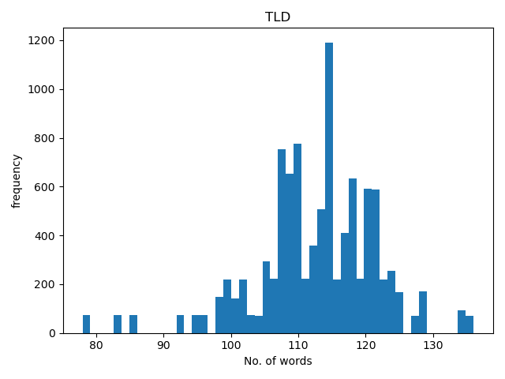
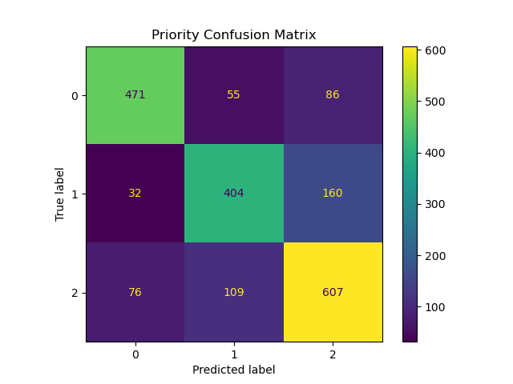
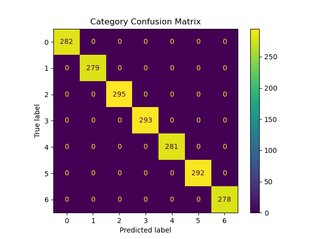

# Customer Support Ticket Intelligent System
## 1. Understanding of the Problem 
The goal of this project is to develop an AI system that automatically summarizes customer complaints and predicts their category and priority using NLP and machine learning techniques. The system automatically processes the complaint text and performs three key tasks:

1. Categorization - Identify the type of issue (e.g., microphone issue, speaker issue, etc.).
2. Priority Assignment - Determine the urgency level of the complaint (High, Medium or Low).
3. Summarization - Generate a short and clear summary of the complaint so that support agents can quickly understand the problem.

## 2. Approach
The approach followed in this project focuses on building an end-to-end AI-based system that can automatically analyze customer complaints and generate meaningful insights. The system processes raw textual input provided by the user and applies Natural Language Processing (NLP) and Machine Learning techniques to predict the complaint category, assign priority, and generate a concise summary.

### 2.1 Data Collection and Understanding

A labeled customer support ticket synthetic dataset was used, containing ticket id, customer name, categories, complaint subjects, descriptions, status and priority levels. The dataset was analyzed to understand text length, class distribution, and data quality before applying any preprocessing steps.
| Category            | Number of Tickets | Dominant Priority |
|---------------------|-------------------|-------------------|
| Speaker Issue       | 966               | Low               |
| Microphone Issue    | 1,026             | Low               |
| Camera Issue        | 1,065             | Medium            |
| Battery Issue       | 985               | Medium            |
| Button Issue        | 993               | Medium            |
| Screen Issue        | 1,283             | High              |
| Motherboard Issue   | 1,064             | High              |





### 2.2 Text Preprocessing

Raw complaint text was cleaned and normalized to remove noise. This included:
- Converting text to lowercase.
- Removing URLs, numbers, and special characters using regular expressions.
- Removing stopwords using NLTK.

### 2.3 Feature Extraction

The cleaned text was converted into numerical features using TF-IDF (Term Frequency–Inverse Document Frequency). Both unigrams and bigrams were considered, and the most informative features were selected. This transformation enabled machine learning models to effectively learn patterns from text data.



### 2.4 Model Training

Supervised machine learning models were trained using the TF-IDF features to predict the complaint category and priority. The following models were implemented:
- Logistic Regression (Final model) – Supervised machine learning algorithm used for classification that models the probability of class membership using a logistic (sigmoid or softmax) function. It learns a linear decision boundary and predicts the most likely class based on probability estimates.
- Support Vector Machine (SVM) – Supervised learning algorithm that separates classes by finding an optimal hyperplane that maximizes the margin between different classes.

### 2.5 Complaint Summarization

Complaint summarization was applied only during the prediction phase. When a user submits a new complaint, an extractive summarization technique based on TF-IDF sentence scoring is used to generate a short and meaningful summary of the complaint. This helps support agents quickly understand the issue.

### 2.6 Prediction and Confidence Estimation

During prediction, the user’s complaint is preprocessed and transformed using the saved TF-IDF vectorizer. The trained Logistic Regression or SVM model predicts the complaint category and priority. Confidence scores are obtained using probabilistic outputs (predict_proba) or calibrated probabilities in the case of SVM. The final system output includes:

- Complaint summary
- Predicted category
- Predicted priority


## 3. Model Performance and Evaluation Metrics

To evaluate the effectiveness of the proposed system, standard classification metrics were used to assess the performance of the trained machine learning models. Both Logistic Regression and Support Vector Machine (SVM) models were evaluated for category prediction and priority prediction.

### 3.1 Evaluation Metrics Used

The following metrics were used to measure model performance:
1. Accuracy – Measures the overall correctness of predictions.
2. Precision – Indicates how many predicted labels are actually correct.
3. Recall – Measures how well the model identifies all relevant instances.
4. F1-score – Harmonic mean of precision and recall, providing a balanced evaluation.
5. Confusion Matrix – Visual representation of correct and incorrect predictions across classes.

#### Logistic Regression Model (Final Model)

The system achieved 1.00 (100%) accuracy for category classification due to clean and well-defined labels, while priority prediction achieved 0.74 (74%) accuracy due to the subjective and context-dependent nature of urgency levels.





### Logistic Regression vs Support Vector Machine

The following comparison was performed using the same subject and description for each test case. This ensures a fair evaluation of Logistic Regression and Support Vector Machine (SVM) models under identical input conditions.

| Test Case | Model | Subject | Predicted Category | Category Confidence | Predicted Priority | Priority Confidence |
|----------|------|---------|-------------------|--------------------|-------------------|--------------------|
| Screen Issue | Logistic Regression | Screen is not working | Screen Issue | 0.705 | High | 0.655 |
| Screen Issue | SVM | Screen is not working | Screen Issue | 0.325 | High | 0.556 |
| Camera Issue | Logistic Regression | Camera is not working | Camera Issue | 0.897 | Medium | 0.608 |
| Camera Issue | SVM | Camera is not working | Camera Issue | 0.421 | Medium | 0.507 |
| Microphone Issue | Logistic Regression | Microphone is not working | Microphone Issue | 0.826 | Low | 0.461 |
| Microphone Issue | SVM | Microphone is not working | Microphone Issue | 0.375 | Low | 0.441 |

- The same subject and description text were used for both models in each test case.
- Both models correctly predicted the category and priority.
- Logistic Regression consistently produced higher confidence scores.
- SVM showed lower confidence values due to its margin-based classification approach.

## 4. Limitations and Solutions

### Limitations

1. The final model used is Logistic Regression, which relies on TF-IDF features and does not understand word context.
2. The system mainly depends on keyword-based patterns, which may reduce accuracy for ambiguous complaints.
3. Priority prediction is less accurate due to the subjective nature of urgency.
4. The dataset used for training is synthetic, which may not fully reflect real-world complaint variations.
5. The generated complaint summary may contain grammatical errors due to extractive summarization.
6. The very clean categorical labels resulted in 100% category accuracy, which may indicate overfitting and limited generalization to real-world data.

### Solutions

1. Context-aware models such as transformer-based architectures can be used to improve semantic understanding.
2. Training the system on real-world customer complaint data can improve generalization.
3. Hybrid approaches combining machine learning with rule-based logic can enhance priority prediction.
4. Advanced neural summarization techniques can improve summary fluency and grammar.
5. Regular validation with unseen and noisy data can reduce overfitting and improve robustness.
6. Introducing noisy and real-world labeled data along with cross-validation and regularization techniques can help reduce overfitting and improve model generalization.

## 5. Possible Future Improvements

1. Integrate context-aware deep learning models to better understand the semantic meaning of complaints.
2. Train the system using real-world customer support data to improve robustness and generalization.
3. Implement advanced neural-based summarization to generate grammatically correct and concise summaries.
4. Enhance priority prediction by combining machine learning with rule-based urgency detection.
5. Deploy the system as a real-time API for integration with customer support platforms.
6. Continuously retrain and fine-tune the model with new incoming complaint data to reduce overfitting.

## 6. How to Use

Follow the steps below to run the prediction system and get the complaint **summary**, **category**, and **priority**.
#### Step 1: Open the Prediction File
Open the prediction script (for example `predict.py` or `predict_svm.py`) in your code editor.

#### Step 2: Enter Complaint Details
Inside the file, locate the `__main__` block and enter the complaint details in the `subject` and `description` variables.

```python
if __name__ == "__main__":
    subject = "Microphone is not working"
    description = "I am experiencing an issue where my voice is not being captured properly during calls or recordings."
```

subject: Short title of the complaint
description: Detailed explanation of the issue
#### Step 3: Run the Script
Run the file using the command line:
python `predict.py`
or (for SVM):
python `predict_svm.py`
#### Step 4: View the Output
The system will display:
A short summary of the complaint
The predicted category
The predicted priority
The confidence score for each prediction
#### Example output:
Summary: Experiencing issue phone voice captured properly during calls
Category: Microphone Issue | Confidence: 0.82
Priority: Low | Confidence: 0.46
#### Step 5: Try Different Complaints
You can test the system by changing the subject and description values to simulate different customer issues such as screen, camera, battery, or audio problems.